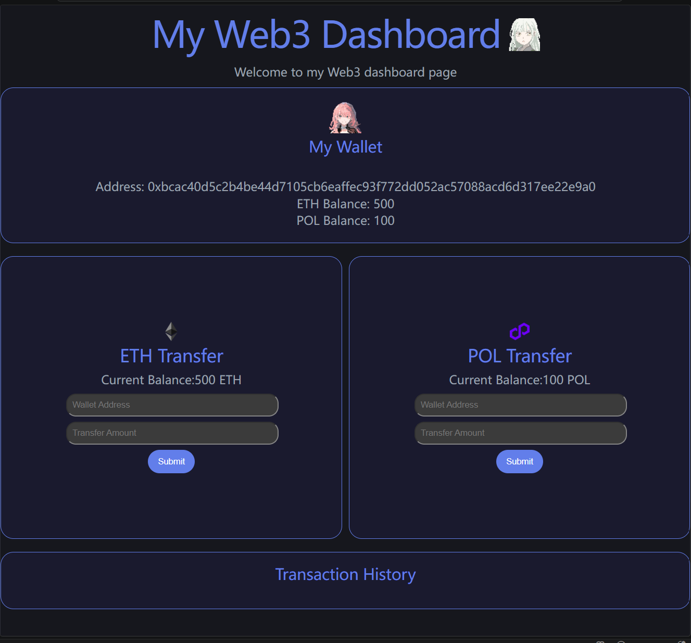
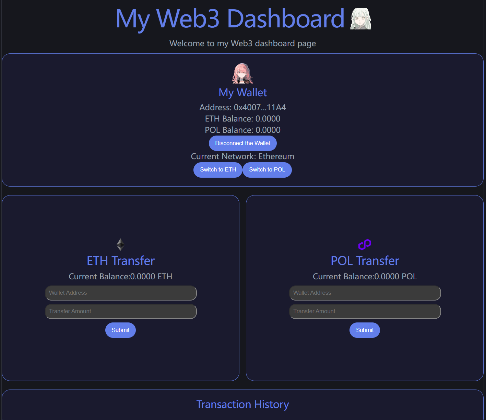
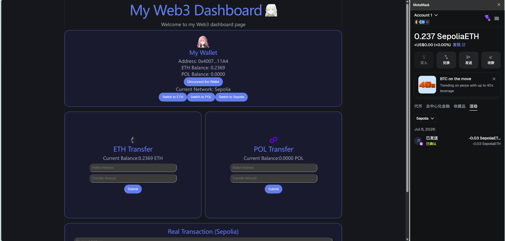

## Web3 学习记录

# 关于这个仓库

记录我从零开始学习 Web3 前端开发的过程，包括代码练习和学习笔记。

## 学习路线

> 第一阶段：HTML + CSS + JavaScript 基础

> 第二阶段：React 框架 + Web3 连接

> 第三阶段：Solidity 智能合约

> 第四阶段：项目实战

## 已完成内容

> 2026.6.17
- HTML 基础标签、语义化结构、表单
- CSS 样式、盒模型、Flexbox 布局
- JavaScript 变量、条件判断、数组、循环、DOM 操作、事件监听
- 实战：Web3 转账模拟页面

> 2026.6.22
- React组件,函数返回JSX，页面拆成独立积木，定义可复用多次
- JSX。JavaScript里写HTML，{}里可以放任何JS表达式
- useState, useEffect。不需要手动操作DOM了
- Props, CSS Modules

> 2026.6.23
- .map()数组方法

> 2026.6.29
- 连接真实钱包
- 优化界面

> 2026.7.8
- 转账功能
- 一个真实可用的DApp

## 项目预览
> 2026.6.17

> 2026.6.22

> 2026.6.23

> 2026.6.29

> 2026.7.8
