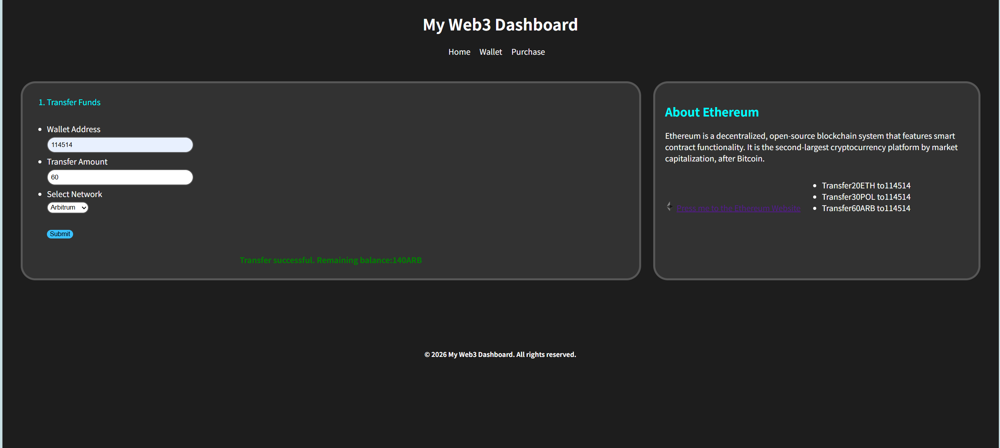
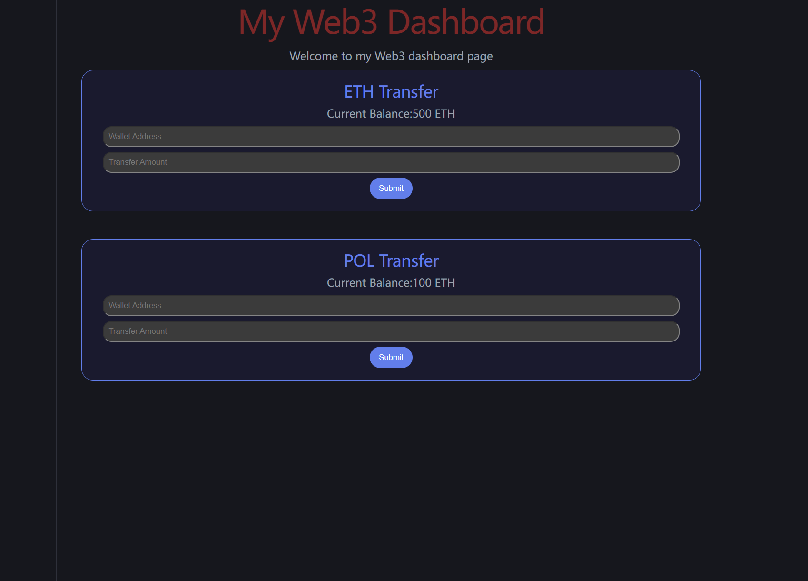

## Web3 Learning Log ##

# About this git
Record the process of learning Web3 front-end development from scratch, including code exercises and study notes

## Learning Route
> Phase 1: HTML + CSS + JavaScript basics

> Phase 2: React Framework + Web3 Connection

> Phase 3: Solidity Smart Contract

> Phase 4: Real Project

## Completed Contents

2026.6.17
- HTML basic tags, semantic structures, forms
- CSS style, box model, Flexbox layout
- JavaScript variables, conditional judgement, array, loop, DOM operation, event listening
- Practical Output: Web3 Transfer simulation page

2026.6.22
- React components
- JSX
- useState, useEffect
- Props, CSS Modules

## Project Preview
2026.6.17

2026.6.22
